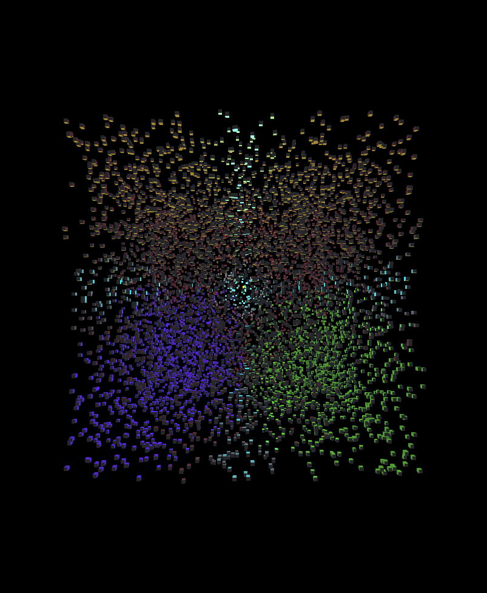

# saturn.js

Small 3D library built on WebGL 2.0.
Maintained by saaaji.

**Note to Developers:** *the frustum culling system has not been finalized and objects may disappear before they are offscreen*

## Completed Features:
  - `Renderer`
  - `Material`
  - `FlatMaterial`
  - `LambertMaterial`
  - `PhongMaterial`
  - `Matrix4`
  - `Vector4`
  - `Vector3`
  - `PointLight`
  - `DirectionalLight`
  - `SpotLight`
  - `RenderObject`
  - `Mesh`
  - `Scene`
  - `Attribute`
  - `Geometry`
  - `TextureLoader`
  - `Texture`
  
## Planned Features:
  - `Quaternion`
  - `GLTFLoader`
  - `AmbientLight`
  - `Shadow` (???)

## Images:
*800 Phong-shaded cubes*

